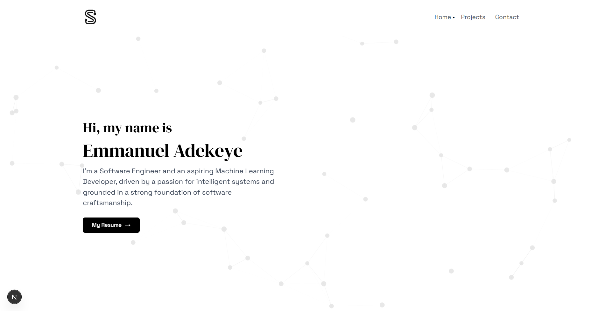

# ✨ Emmanuel Adekeye — Developer Portfolio

Welcome to my personal portfolio website, built with modern web tools like **Next.js**, **Tailwind CSS**, **ShadCN UI**, and **React Icons**. This site showcases my projects, skills, and a bit about who I am as a developer.

---

## 🔧 Tech Stack

- **Next.js** — React framework with App Router for fast, SEO-friendly pages
- **Tailwind CSS** — Utility-first CSS for rapid and responsive design
- **ShadCN UI** — Accessible and customizable component library powered by Radix UI
- **React Icons** — Clean and scalable icons, including brand icons like GitHub, Twitter, etc.

---

## 🚀 Getting Started

```bash
git clone https://github.com/AdekeyeAdeniyi/my_porfolio.git
cd my_porfolio
npm install
npm run dev
```

Visit your portfolio at: [http://localhost:3000](http://localhost:3000)

---

## 💼 Sections Included

- 🏠 **Home** – Intro and headline
- 💡 **Projects** – Featured work with links to live demos and GitHub
- 📫 **Contact** – Get in touch via form or social links

---

## 📷 Preview



---

## 📎 Useful Links

- [Tailwind CSS Docs](https://tailwindcss.com/docs)
- [Next.js App Router Docs](https://nextjs.org/docs/app)
- [ShadCN UI Docs](https://ui.shadcn.dev)
- [React Icons Library](https://react-icons.github.io/react-icons)

---

## 📄 License

This project is open-source and licensed under the [MIT License](LICENSE).

---

## 🙏 Acknowledgements

Special thanks to:

- [ShadCN](https://ui.shadcn.dev)
- [Tailwind Labs](https://tailwindcss.com)
- [Vercel](https://vercel.com) for hosting
